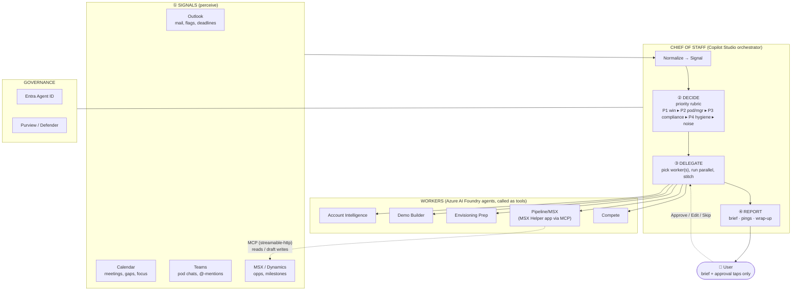
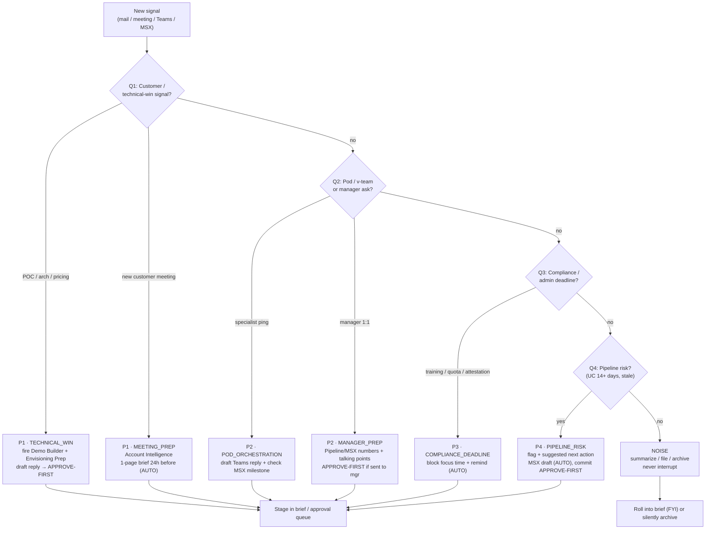
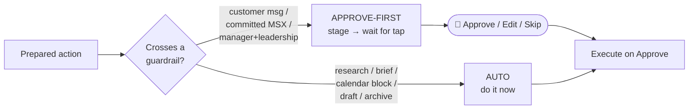

# Chief of Staff — Architecture & Decision Flow

Two views: the **system architecture** (what connects to what) and the **decision flow**
(how a single signal is routed). Both render in VS Code / GitHub. An Excalidraw source is
also provided at [architecture.excalidraw](./architecture.excalidraw) for export to PNG.

## 1. System architecture

## 2. Decision flow (one signal)

## 3. Autonomy gate (applied before any outbound action)

