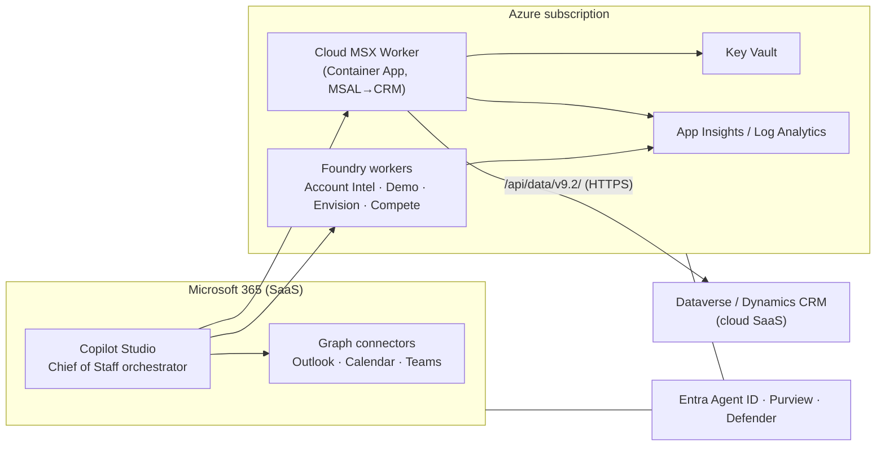

# Chief of Staff — Cloud-Hosted Deployment

Makes the whole system run in Azure with **no localhost dependency**. The desktop **MSX
Helper** stays as your local/dev convenience; for cloud we deploy a **Cloud MSX Worker**
that does the same thing MSX Helper does — MSAL auth + Dynamics CRM Web API
(`/api/data/v9.2/`), draft-only writes — but as a hosted service the orchestrator can reach.

Pairs with [orchestrator-prompt.md](./orchestrator-prompt.md), [architecture.md](./architecture.md),
and [build-doc-triggers-approvals.md](./build-doc-triggers-approvals.md).

## The core problem & the fix

- **Problem:** MSX Helper's MCP server listens on `http://localhost:<port>/` on *your*
  machine. A cloud-hosted Copilot Studio orchestrator can't reach `localhost`.
- **Fix:** MSX Helper adds no secret sauce beyond MSAL + CRM Web API calls. Reproduce that
  in a **Cloud MSX Worker** (the repo's `se_agent` `msx` tool already implements the exact
  contract via `HttpCrmClient` + `MsalTokenProvider`). Host it; expose it as an MCP /
  OpenAPI tool over HTTPS. Now it's reachable from the cloud.

## Two cloud topologies

### Option A — Fully cloud-hosted (recommended)



Everything is hosted; the user only sees Teams. No desktop app required.

### Option B — Hybrid (keep MSX Helper on the desktop)

Cloud orchestrator, but the MSX worker runs locally beside MSX Helper and is reached via a
secure outbound tunnel (no inbound localhost exposure):

- **Azure Relay (Hybrid Connections)** or **Dev Tunnels** publishes the local MCP endpoint
  to a stable HTTPS URL the orchestrator calls.
- Good for a hackathon/demo where you don't want to stand up CRM app-only auth yet.
- Trade-off: depends on your machine being on; not production-grade.

> Recommendation: **Option A** for anything beyond a demo. Option B is the 1-hour shortcut.

## Cloud MSX Worker — what to deploy

The worker IS the `se_agent` package's `msx` path, wrapped in a thin HTTP/MCP service.

| Concern | Choice | Notes |
|---------|--------|-------|
| Compute | **Azure Container Apps** | Scales to zero, HTTPS ingress, easy MCP/OpenAPI host. (Functions or App Service also fine.) |
| Auth to CRM | **Entra app registration**, app-only (client credentials) → Dataverse `/.default` | Same MSAL flow MSX Helper uses; `MsalTokenProvider` already implements it |
| Worker identity | **Managed Identity** + Key Vault references | No secrets in the image |
| Secrets | **Key Vault**: CRM URL, client id/secret (or use federated credential to drop the secret) | `SEAGENT_*` env vars resolve from KV |
| Exposure | MCP `streamable-http` **or** OpenAPI tool | Register in Copilot Studio as a custom connector / MCP tool |
| Writes | **Draft-only** until APPROVE-FIRST | Commit endpoint gated by orchestrator approval |
| Observability | **App Insights** | Per-call logs, latency, redaction (logging.py) |

### Endpoints (OpenAPI shape)

```
GET  /healthz
POST /msx/query        { operation, account_name?, top? }            -> data
POST /msx/draft        { operation: draft_milestone_update, ... }     -> { draft }
POST /msx/commit       { draft_id }   # requires approval token       -> { committed }
```

(Or expose the equivalent as MCP tools via `tools/list` / `tools/call`.)

## Identity & security (cloud)

- **Entra Agent ID** for the orchestrator; **Managed Identity** for the Cloud MSX Worker
  and Foundry workers. No shared secrets between tiers.
- CRM access is **app-only** with least privilege on Dataverse; prefer a **federated
  credential** so there's no client secret at all.
- **Approval = the write boundary** still holds: `/msx/commit` and any customer/manager
  message require an approved Adaptive Card; the worker rejects commits without the token,
  then applies a real CRM **PATCH** (`If-Match: *`) via the live client.
- **Entra Easy Auth front door (network boundary):** enable built-in Entra authentication
  on the Container App so unauthenticated calls are rejected (`Return401`) before reaching
  the app. Deploy with `azd env set SEAGENT_ENABLE_EASY_AUTH true` and
  `azd env set SEAGENT_EASY_AUTH_CLIENT_ID <app-id>`. The orchestrator then calls the worker
  with an Entra token for that app (in addition to the per-commit approval token).
- **Private networking (prod):** put the worker on a VNet, reach Dataverse/Key Vault via
  Private Endpoints; restrict ingress to Copilot Studio / Foundry egress IPs.
- **Purview + Defender for Cloud Apps** for DLP, classification, and anomaly detection on
  the agent identities. Full audit trail: Signal → decision → action → approval.

## Deploy with azd (suggested)

A minimal `infra/` (Bicep) + `azure.yaml` provisions: Container Apps env + the MSX Worker,
Key Vault, Managed Identity, Log Analytics/App Insights. Then:

```bash
azd auth login
azd up          # provisions infra + deploys the Cloud MSX Worker container
# outputs: MSX_WORKER_URL=https://<app>.<region>.azurecontainerapps.io
```

Wire `MSX_WORKER_URL` into Copilot Studio as the Pipeline/MSX tool. Foundry workers deploy
as hosted/prompt agents (see the `microsoft-foundry` skill) and are registered as tools.

> The container just needs the `se_agent` package + a tiny FastAPI/Flask (or MCP) shim that
> maps the endpoints above onto `MsxTool` with `HttpCrmClient` + `MsalTokenProvider`, with
> `SEAGENT_*` resolved from Key Vault. No code rewrite — it's the same tool, hosted.

## Cost & ops notes

- Container Apps **scale-to-zero** keeps idle cost near nothing; cold start is fine for an
  agent worker.
- Schedule the orchestrator sweeps (07:15 / 12:30 / 17:00) in Copilot Studio — no always-on
  compute needed on the worker side.
- Start single-region; add a second region only if the orchestrator SLA requires it.

## Migration path (today → cloud)

1. **Demo now:** Option B — MSX Helper local + Dev Tunnel/Azure Relay → cloud orchestrator.
2. **Stand up the worker:** `azd up` the Cloud MSX Worker (Option A); point Copilot Studio
   at `MSX_WORKER_URL`. Retire the tunnel.
3. **Harden:** app-only CRM auth via federated credential, VNet + Private Endpoints, Purview
   DLP, Defender monitoring, full audit.
4. **Scale workers:** deploy the four Foundry workers; the orchestrator already calls them
   as tools.
